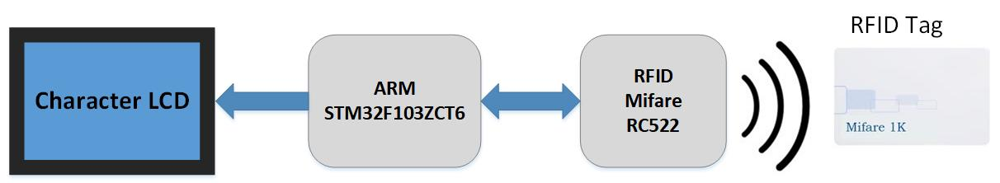

## Driving RFID RC522 module by STM32 

A demo project to drive **RFID MIFARE module (RC522)**. An ARM micro-controller (STM32F103ZCT6) along with a 4*16 character LCD is used to drive the RC522 module. The program utilizes a MFRC522 library which includes the basic functions to exchange data to/from the RFID card through the RC522 module. The main process in this program is authentication of a smart card, so that it can be used in **Access Control**, **Security**, and **IoT** related projects.  

Overall Block Diagram:

The hardware is provided with two keys to set and unset a smart card. Once a card is set it is granted as an authentic card by the device and when the card is unset it's not considered as an authorized card. This process is performed by writing a scrambled data in data sector of the card. Scrambling is done through a secret key in the program by the aim of increasing security of authentication process. [Link_to_Firmware_main_code](Firmware_stm32f103zct6/Src/main.c)
 
 

## Author
### Hamid Reza Tanhaei
